目的：将ip地址设置为静态，这样IP地址就不会随意变动。将虚拟机的IP地址设置为192.168.123.4，将本机的IP地址设置为192.168.123.1。

## 虚拟网络编辑器设置

1. 打开虚拟网络编辑器
   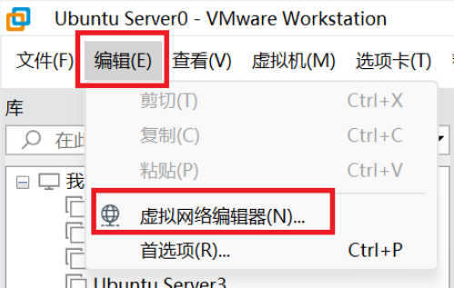
2. 选择NAT模式的网卡并点击更改设置
   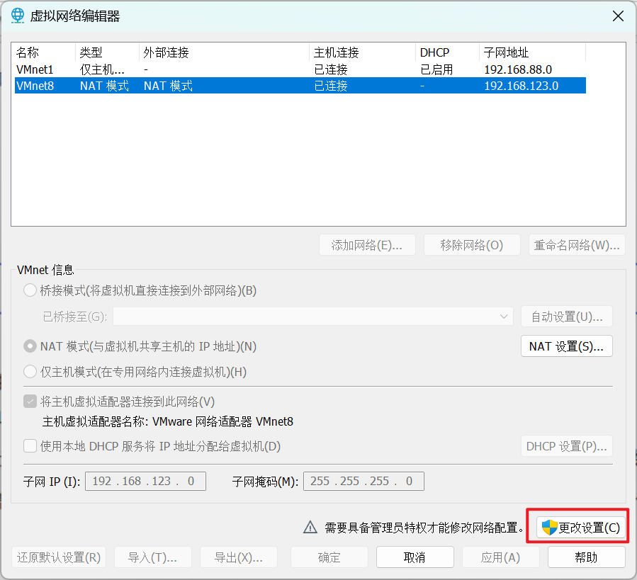
3. 进行一系列配置
   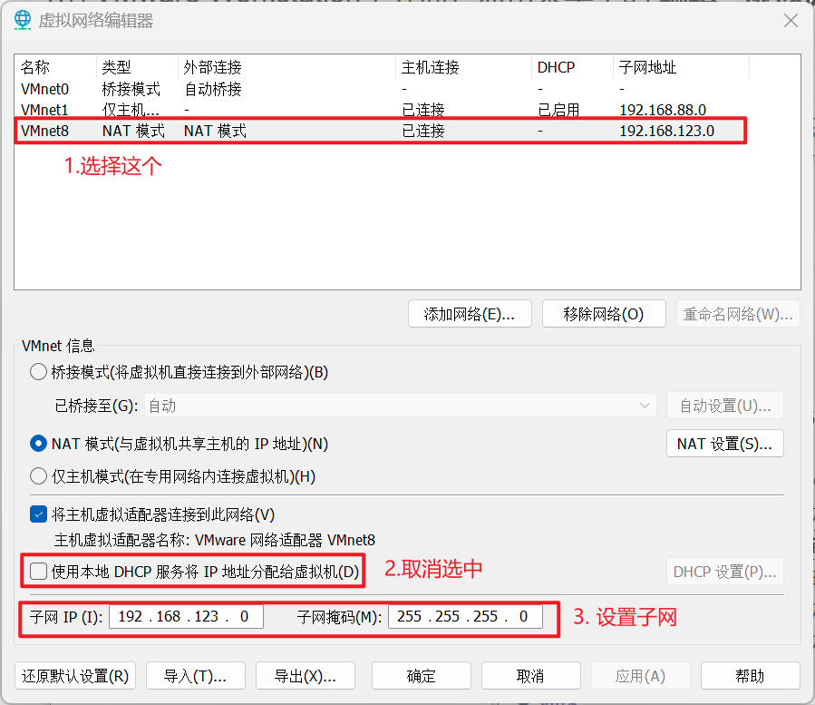

4. 点击NAT设置
   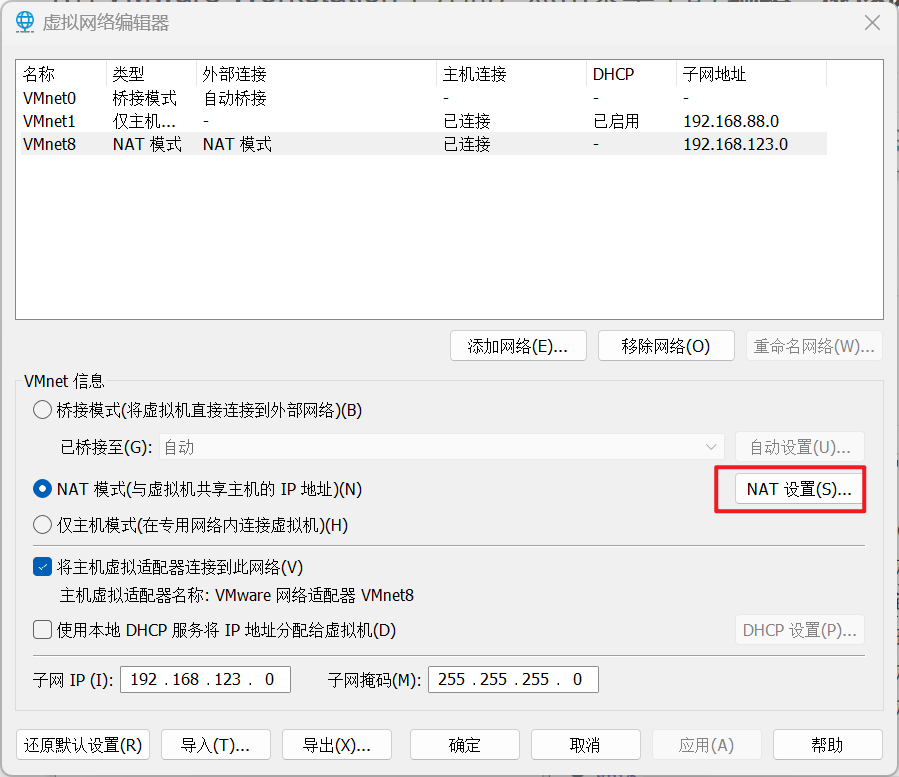
5. 修改对应的网关
   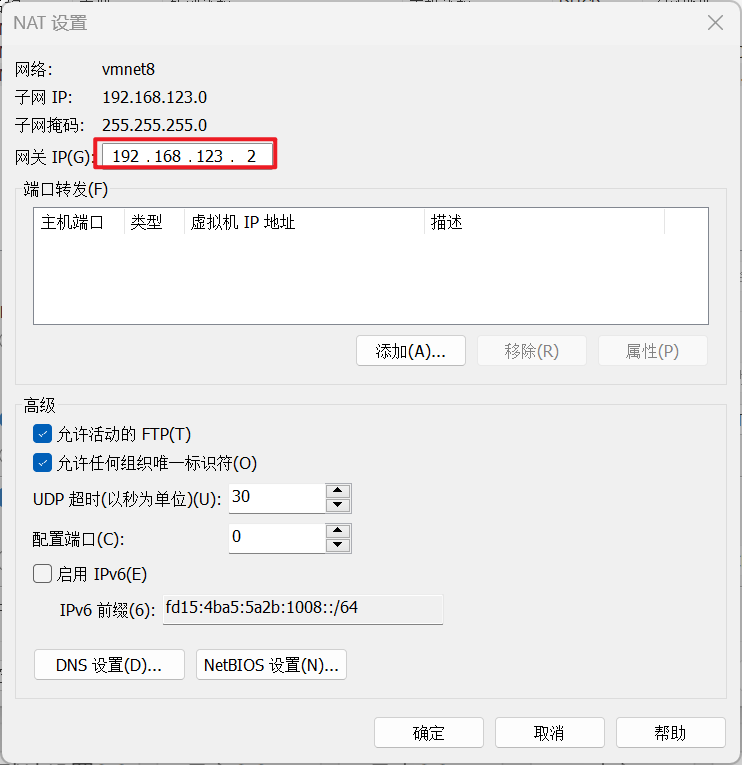

## 修改虚拟机的IP地址

1. 打开虚拟机的终端，输入`ip a`获取当前网卡的IP地址和网卡号。如下图的IP地址为`192.168.230.4`，网卡为ens33
   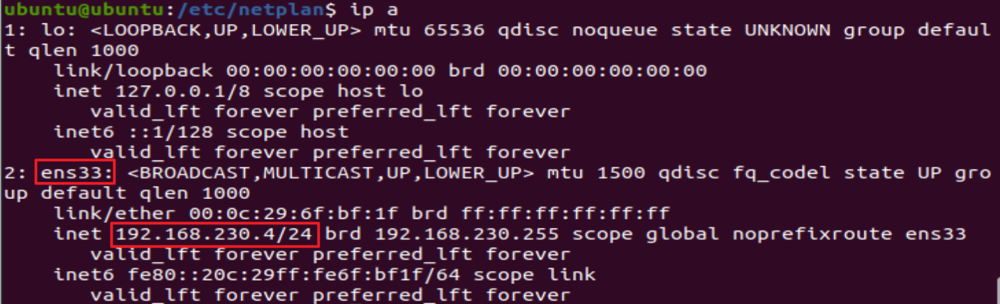

2. 设置虚拟机特定网卡的IP地址。修改虚拟机中`/etc/netplan`下的`yaml`文件即可。格式如下：
   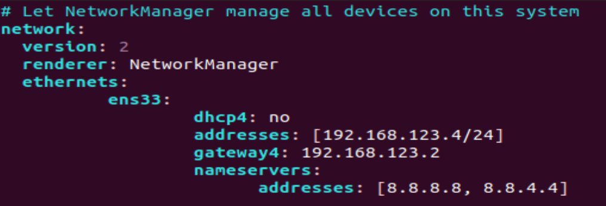

   其中addresses代表IP地址，gateway4代表网关地址。nameservers下的addresses代表DNS服务器地址。

   > Tips：注意使用`sudo vim`来修改此文件 

3. 输入命令`sudo netplan apply`来更新

## 修改本机的IP地址

1. 搜索网络适配器
   

2. 找到对应的虚拟机网卡进行编辑

   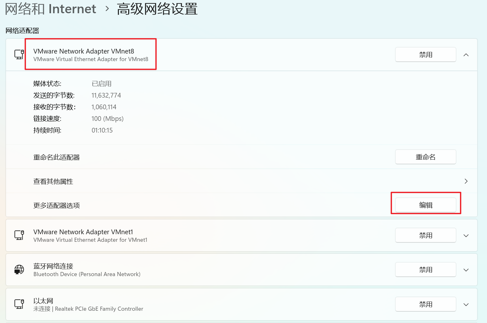

3. 选择Internet 协议版本4
   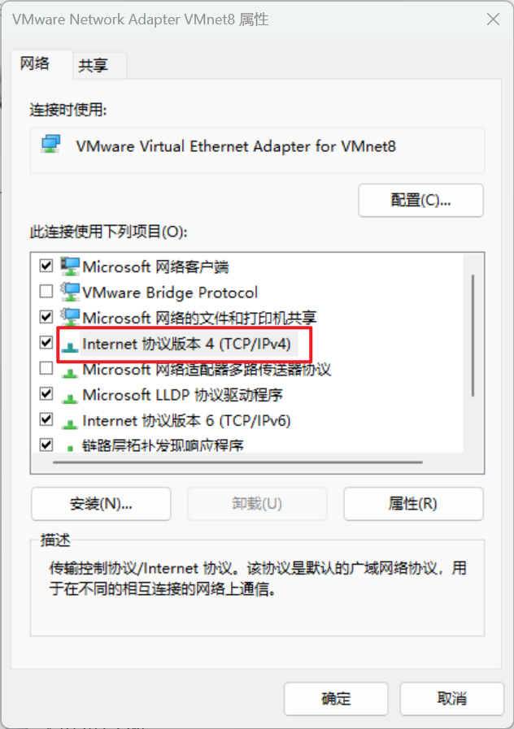

4. 按下面的格式修改信息即可，然后点击确定
   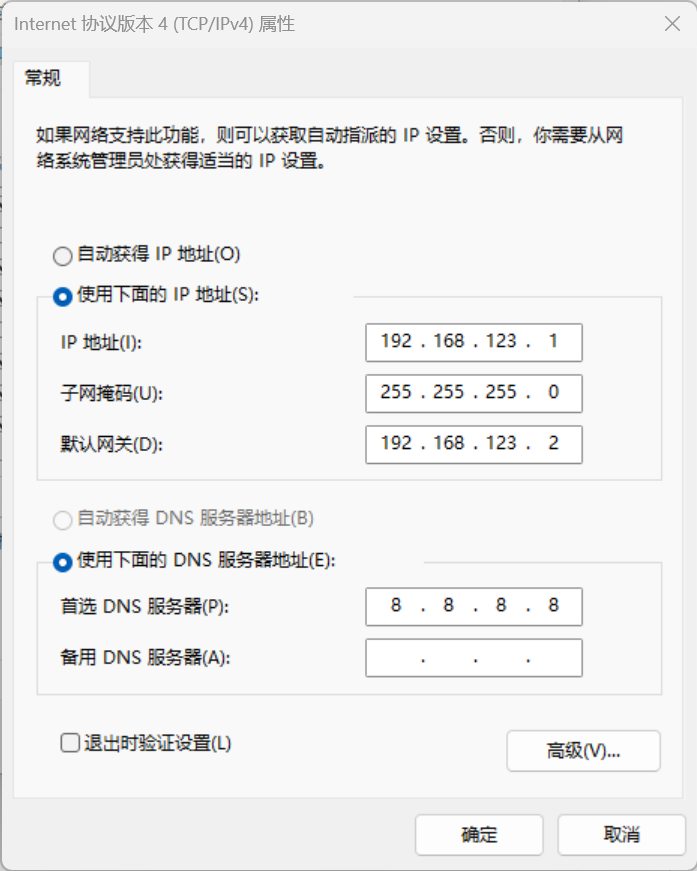

## 设置虚拟机的代理

按照如下格式设置即可

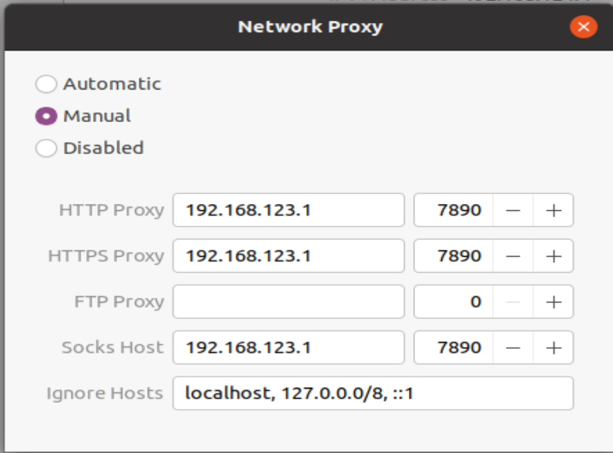