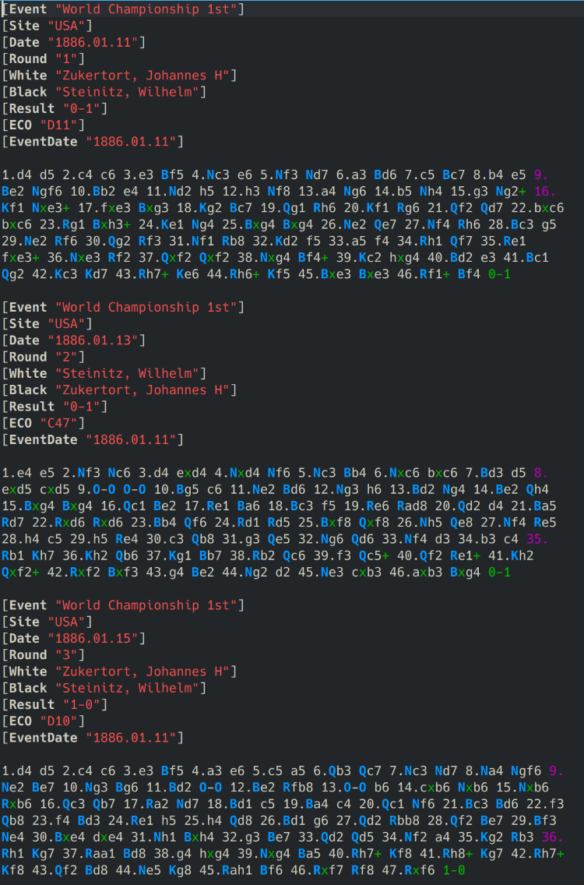
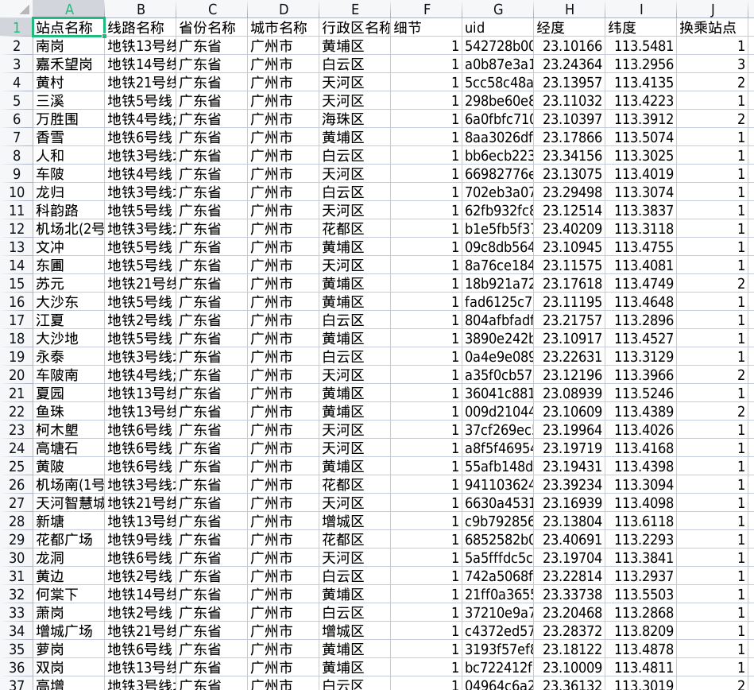

## 国际象棋对局数据
### 数据样式
一个名为 `WCC.pgn` 的文件，包含很多对局信息。前面是名称地点人物等信息，后面是对局落子信息。[下载链接](https://chessproblem.my-free-games.com/chess/games/Download-PGN.php)




### 目的
将对局信息保存到一个 `csv` 文件当中（不包括落子信息）

### 实现代码
精简版：
```python
with open('/kaggle/input/wccchessgame/WCC.pgn', 'r', encoding='utf-8') as file:
    lines = file.readlines()
game = {}
games_list = []  # 用于存储所有游戏信息的列表

for line in lines:
    if line.startswith("["):
        tag, value = line[1:-1].split(" ", 1)
        game[str(tag)] = value.strip('"')
        game[str(tag)] = value.strip('"]')  # 去掉多余的字符
    else:
        if game:
            games_list.append(game)  # 将游戏信息添加到列表中
            game = {}
    
df = pd.DataFrame(games_list)
df.to_csv('output.csv', index=False)
```

如果要将特定的两列放在前面，使用下面的代码：
```python
with open('/kaggle/input/wccchessgame/WCC.pgn', 'r', encoding='utf-8') as file:
    lines = file.readlines()
game = {}
games_list = []  # 用于存储所有游戏信息的列表

for line in lines:
    if line.startswith("["):
        tag, value = line[1:-1].split(" ", 1)
        game[str(tag)] = value.strip('"')
        game[str(tag)] = value.strip('"]')  # 去掉多余的字符
    else:
        if game:
            white = game.pop("White")
            black = game.pop("Black")
            game_record = {"White": white, "Black": black}
            game_record.update(game)
            games_list.append(game_record)  # 将游戏信息添加到列表中
            game = {}
    
df = pd.DataFrame(games_list)
df.to_csv('output.csv', index=False)
```

## 地铁站数据集
### 数据样式
[下载链接](https://www.heywhale.com/mw/dataset/6071478175e8a300175be71d/content)
在使用 pandas 打开时遇到乱码问题，参考[此文章](https://blog.csdn.net/qq_38614074/article/details/139508093) 



